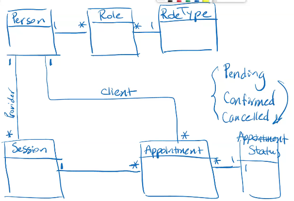

[![Contributors][contributors-shield]][contributors-url]
[![Issues][issues-shield]][issues-url]

# cs544_project

Rest API that will automate the process of making TM checking appointments online. 

### Requirements

This system has a database of users and roles and based on roles, users will be able to perform actions. 
 

* This system supports three roles: Admin, Counselor and Customer. 
* A “Person” is a user of the system, we need to keep track of person ID, first and last name, email 
address and obviously username, password and set of roles. Person can have multiple roles. 
* Appointments are made for “Sessions”. Each session has a date, start time, duration (in 
minutes), number of seats (capacity), location and counselor (the person leading the session). 
* “Appointments” connect persons to sessions. Remember that in general, each person can make 
multiple appointments. 
* Each session can have multiple “AppointmentRequests”, but in the end, only one of these 
requests can be approved as an “Appointment”. If an appointment gets cancelled, the first 
AppointmentRequest from the list can fill its position. 
* Appointments can only be changed for future sessions. Past sessions cannot be changed by 
anyone 
* AppointmentRequests can only be made for future sessions. 
* Admins can create and manage (CRUD operations) “Sessions”. 
* Each person can create new appointments for himself/herself and manage his/her existing 
appointments. Appointments can be cancelled or modified up to 48 hours before the session 
after that only admin can make changes. 
* Send an email (to the creator of appointment, counselor and customer), each time an 
appointment is created or modified. 

### Class Diagram

    

### Technologies

This section should list any major frameworks used to built the project.
* Spring boot
* JPA & Hibernate
* Spring Security
* Spring Validation
* MySql/Postgresql
* lombok
* JMS & ActiveMQ
* Test: Mockito, assertj
* Restful API
* Deployment(heroku)
* Actuator

<!-- MARKDOWN LINKS & IMAGES -->
<!-- https://www.markdownguide.org/basic-syntax/#reference-style-links -->
[contributors-shield]: https://img.shields.io/github/contributors/johnsales/cs544_project.svg?style=for-the-badge
[contributors-url]: https://github.com/johnsales/cs544_project/graphs/contributors
[issues-shield]: https://img.shields.io/github/issues/johnsales/cs544_project.svg?style=for-the-badge
[issues-url]: https://github.com/johnsales/cs544_project/issues

### Publication
https://cs544-project.herokuapp.com/
